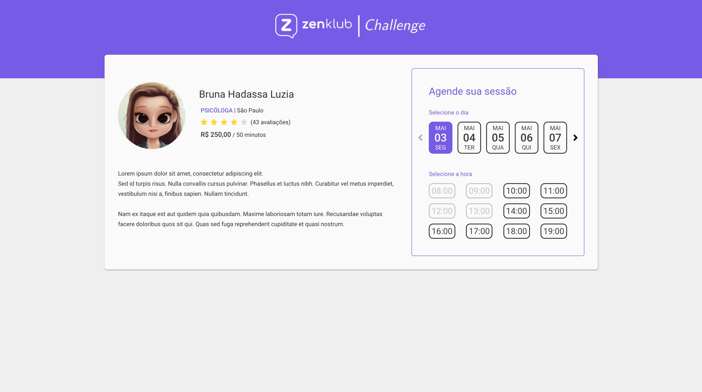

<h1 align="center">
  Zenklub Challenge
</h1>

### Para ver o projeto rodando acesse: https://challenge-zenklub.web.app/



## Sobre o projeto

O projeto foi criado com o objetivo de desenvolver o desafio proposto pela Zenklub.

O desafio inclui:

- Mostrar informações sobre o especialista

- Apartir de um backend, listar as datas disponíveis para um agendamento com o especialista


## Tecnologias usadas:

- `Angular 11`: Utilizado para a criação do frontend;

- `Pipedream`: Utilizado para a criação do mock da api;

## Como executar o projeto

### Instalar dependências do projeto
Executar os comandos abaixo.

```sh
cd zenklub-challenge
npm install
```

ou 

```sh
cd zenklub-challenge
yarn
```

### Executar o projeto
Executar os comandos abaixo.

```sh
npm run start
```
ou
```sh
yarn start
```

### Acessar o projeto
Acesse o projeto através do endereço:
```sh
http://localhost:4200
```
